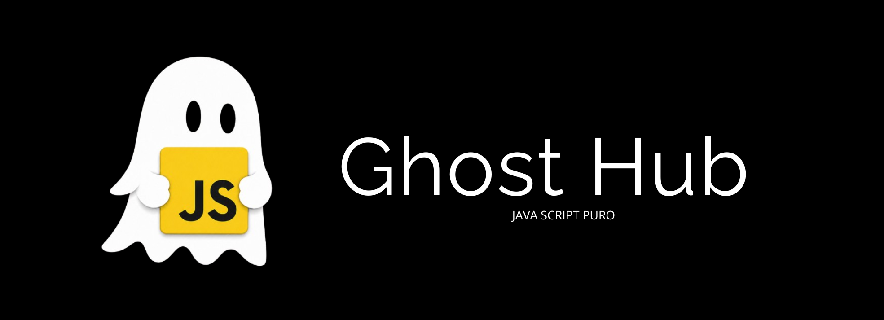

# Ghost Hub

## O que é?

**Ghost Hub** é uma plataforma completa para automação de missões do Discord, gerenciamento de perfis, visualização de badges, Orbs e ferramentas exclusivas.

## Arquivos

| Arquivo | Descrição |
|---------|-----------|
| `script.js` | **Backend principal — contém tudo.** Servidor Express, autenticação JWT, rate limiting, circuit breaker, integração com Discord selfbot, sistema de quests, workers multi-thread e proxy rotativo. |
| `README.md` | Este arquivo — documentação do projeto |
| `ghosthub.png` | Logo oficial do Ghost Hub |

## O que o script.js faz?

- **Automação de missões (Quests)** do Discord — watch video, play on desktop, stream, etc.
- **Lista Orbs** — visualiza e gerencia seus Orbs do Discord
- **Badges & Perfil** — mostra badges, infos de perfil e status
- **Login com token Discord** via selfbot (discord.js-selfbot-v13)
- **Dashboard web** — painel para controle visual

## Como usar

```bash
npm install
node script.js
```

O servidor sobe na porta **80** (ou na porta definida em `PORT`).

## Segurança

- Tokens Discord nunca são expostos ao frontend
- Sessões JWT com expiração automática
- Rate limit por IP, sessão e token
- Proteção contra brute force no login

## Stack

- Node.js
- Express
- discord.js-selfbot-v13
- worker_threads
- node-fetch

---

@jsghost.png
